# 概述
goby内置了扩展能力，在插件API加持之下，goby指定的部分可以自定义或者加强。

本文档将介绍：
 - 如何构建、运行、调试、测试和发布插件
 - 如何利用好goby的插件API
 - 显示相关指南和代码示例，方便你快速入门

## 插件能做什么？
下面我们看看使用插件API能做到些什么：

1. 在UI中添加自定义组件和视图 - 扩展工作台

如果你想大概浏览一下所有的插件API，请参阅插件功能概述。插件示例列出了各种插件API使用的示例代码和指南。

## 如何构建插件？
想要做出一个好插件需要花费不少精力，我们先来看看这个教程的每个章节能为你做点什么：

 - **第一步** 使用helloWorld例子教你贯穿于制作插件时的基本概念
 - **开发插件** 包含了各类插件开发的流程，比如测试、打包、发布插件
 - **插件功能** 将goby的API拆解成了几个小分类，帮你掌握到每个场景下的开发细节
 - **插件示例** 包括指南和代码实例，详细介绍特定API的使用场景
 - **参考** 包括详细的goby API,贡献点等其他内容

# 第一步
## 你的第一个插件
在本小节中，我们会教你一些基础概念，请先安装开发版goby(**该版本目前仅对内测用户开发**)，之后你需要下载一个可以立马开发的项目[(helloWorld)](http://gobies.org/helloWorld.zip)，将其解压到**goby/extensions**目录下，然后启动goby。

点击开始扫描，你会发现扫描弹窗顶部会有一个hello的按钮，点击按钮，如果出现了helloWorld提示信息弹窗，那么恭喜你运行成功了！


### 开发插件

现在让我们稍稍改动一下弹窗显示的内容：
 -  进入项目目录，goby/extensions/helloWorld/src/extension.js
 - 把文件里goby.showInformationMessage中的helloWorld改为hellogoby
 - 重启goby，点击开始扫描，点击hello按钮

这时你应该就能看到弹窗的消息更新了：

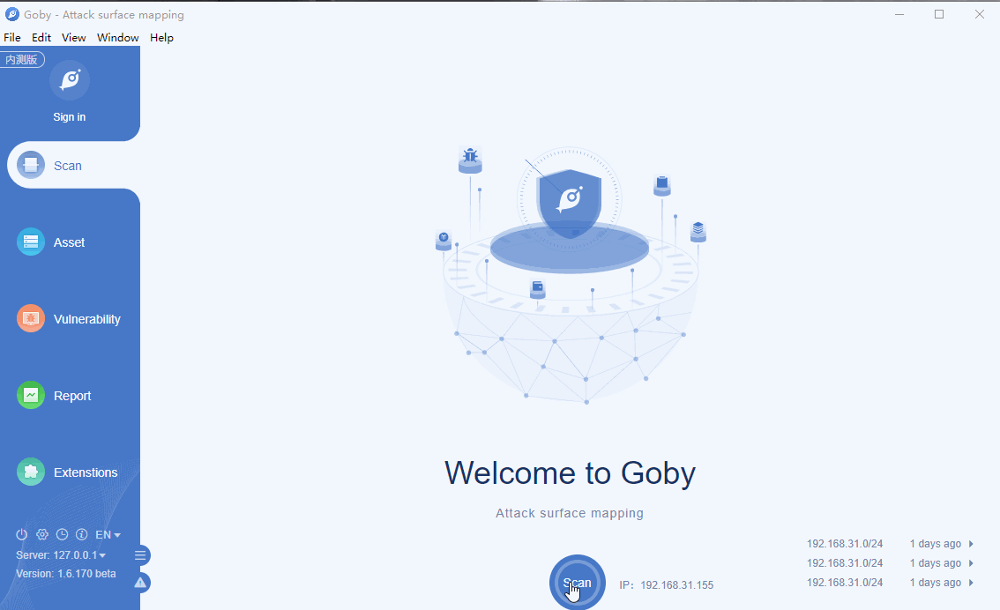

### 使用 **Javascript**
在本文档中，我们主要使用js开发goby插件。

## 解析插件结构
上一节中，你已经能够自己创建一个基础的插件了,但是它究竟是怎么运作的呢？

理解下面两个关键概念你才能作出一个基本的插件：

 -  **发布内容配置**：goby扩展了 package.json（插件清单）的字段以便于开发插件
 - **goby API**：你的插件代码中需要调用的一系列JavaScript API

大体上，你的插件就是通过组合发布内容配置和goby API扩展goby的功能。你能在插件功能概述章节中找到合适你插件的贡献点和goby API。

现在让我们自己看一看helloWorld示例的源码部分，以及我们上面提到的两个概念是如何应用其中的。

### 插件目录结构
      
          ├── .gitignore          // 忽略构建输出和node_modules文件
          ├── README.md           // 插件介绍文档
          ├── CHANGELOG.md        // 插件更新日志文档
          ├── src
          │   └── extension.js    // 插件源代码
          ├── package.json        // 插件配置清单
   
      
目前，让我们把精力集中在这个插件的关键部分——package.json和extensions.js。

###### 插件清单
每个goby插件都必须包含一个package.json，它就是插件的配置清单。package.json混合了Node.js字段，如：scripts、dependencies，还加入了一些goby独有的字段，如：publisher、initEvents、contributes等。关于这些goby字段说明都在插件清单参考中可以找到。我们在本节只介绍一些非常重要的字段：

 -  **name**: 插件的名称。
 - **publisher**: 发行者名称。goby根据publisher、name组合作为一个插件的ID。
 - **main**: 插件的主入口文件。
 - **initEvents**和**contributes**: 初始化事件和发布内容配置。 
 - **engines**: 描述了这个插件依赖的最低goby版本。

        
      

``` json
    {
            "name": "helloWorld",
            "publisher": "goby",
            "description": "helloWorld by goby",
            "version": "0.1.0",
            "icon": "",
            "engines": "1.6.170",
            "initEvents": "",
            "main": "./src/extension.js",
            "contributes": {
              "views": {
                "scanDia": [
                  {
                    "command": "hello",
                    "title": "hello"
                  }
                ]
              }
            },
            "scripts": {},
            "devDependencies": {},
            "dependencies": {}
          }
```
        
      
###### 插件入口文件
插件入口文件需要导出一个函数，activate，当插件安装成功后，会执行这个函数。

        
      

``` scilab
    function activate (content) {
            goby.registerCommand('hello', function (content) {
              goby.showInformationMessage("helloWorld");
            });
          }
          
          exports.activate = activate;
```
        
      
## 小结
在本节中，你学会了如何创建，运行和调试插件，也学习了有关goby插件开发的基本概念。但这仅是初级入门，在之后的章节会进一步详细讲解如何开发插件。

# 开发插件
## 测试插件
开发版goby为插件开发提供了运行和调试的能力，你只需要将你的插件放到**goby/extensions**目录下，然后启动goby就可以了。

你可以点击**view**按钮，选择**toggle developer tools**，调出控制台。

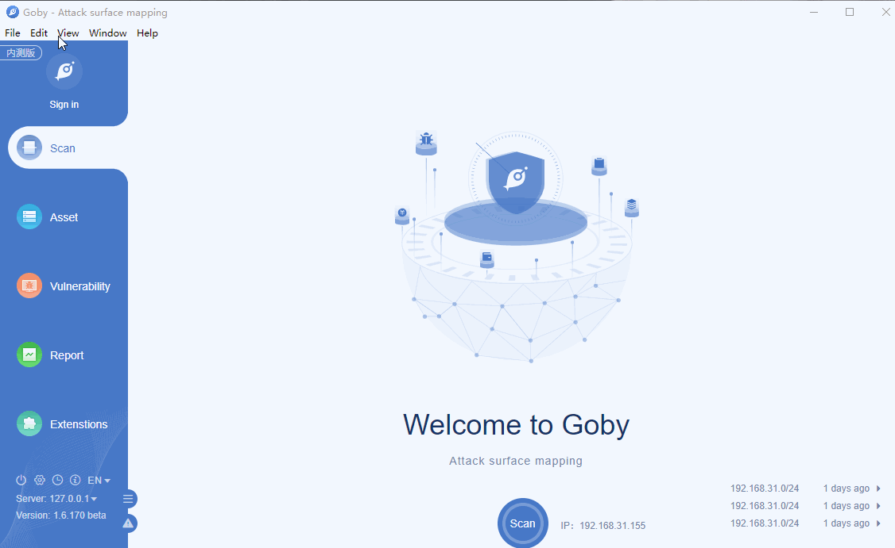

## 发布插件
发布流程：

 - 用户注册
 - 插件打包
 - 插件发布
 - 插件删除

### 用户注册
发布goby插件，首先需要[注册](https://gobies.org/user/register)成为goby用户。

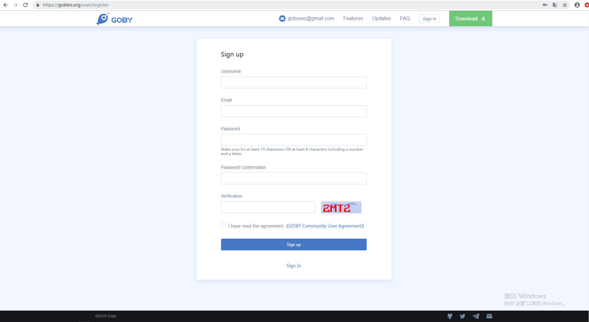

### 插件打包
提交的goby插件，目前只支持zip格式包，你可以自己打包成zip上传，也可以参考打包插件章节进行自动化打包。

需要特别注意的是：打包时必须把插件文件夹整个打包，即执行自动解压后，要确保整个插件的目录结构是完整的。

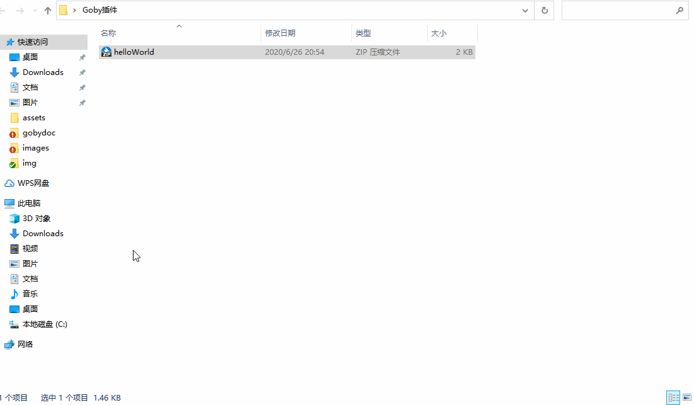

### 插件发布
用户在goby登录后，可以在个人中心-插件页点击发布插件，上传zip包之后，会有专门人员进行审核，通过审核之后，插件才会出现在市场列表里。


### 插件删除
你可以在个人中心-插件页里，删除插件。

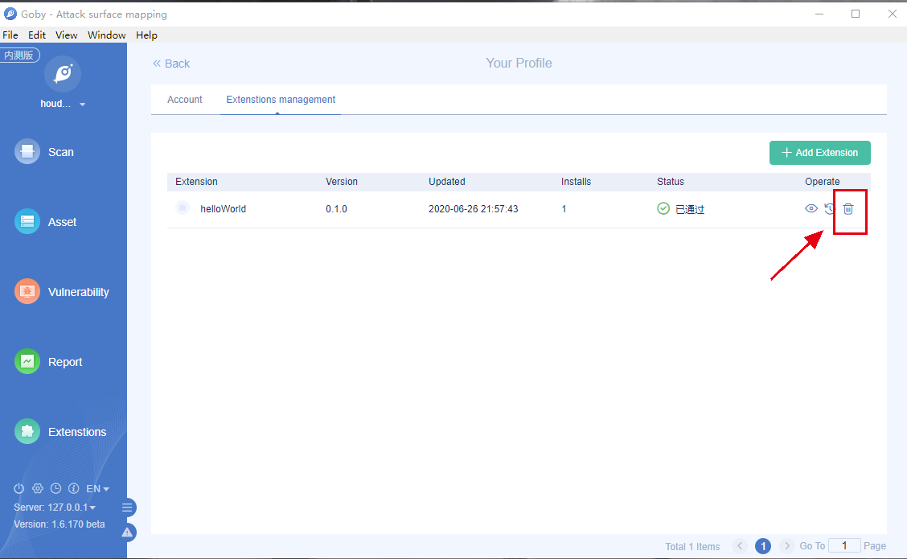

## 打包插件
之前已经提过，goby插件提交时，只支持zip格式上传，对于Javascript而言，可选的打包工具非常多，本节主要演示使用[jszip](https://www.npmjs.com/package/jszip)进行打包。

1. 首先需要安装jszip包

        
  

``` ebnf
        npm install jszip
```
        
      
2. 然后，在你的插件目录下新建build.js打包脚本

        
     

``` javascript
     var JSZip = require('jszip');
          var fs = require('fs');
          var path = require("path");
          var zip = new JSZip();

          // 打包文件
          zip.file("package.json", fs.readFileSync(__dirname+"/package.json"));
          zip.file("CHANGELOG.md", fs.readFileSync(__dirname + "/CHANGELOG.md"));
          zip.file("README.md", fs.readFileSync(__dirname + "/README.md"));

          // 打包文件夹里的文件
          var src = zip.folder("src");
          src.file("extension.js", fs.readFileSync(__dirname + "/src/extension.js"));

          // 压缩
          zip.generateAsync({
            // 压缩类型选择nodebuffer，在回调函数中会返回zip压缩包的Buffer的值，再利用fs保存至本地
            type: "nodebuffer"
          }).then(function (content) {
            let zip = '.zip';
            // 写入磁盘
            fs.writeFile(__dirname + zip, content, function (err) {
              if (!err) {
                // 写入磁盘成功
                console.log('压缩成功');
              } else {
                console.log('压缩失败');
              }
            });
          });
```
        
      
3. 最后，在插件目录里执行打包命令,压缩成功后就可以在**goby/extensions**目录下，看见打包的zip文件。

        
      

``` crmsh
    node ./build.js
```
        
   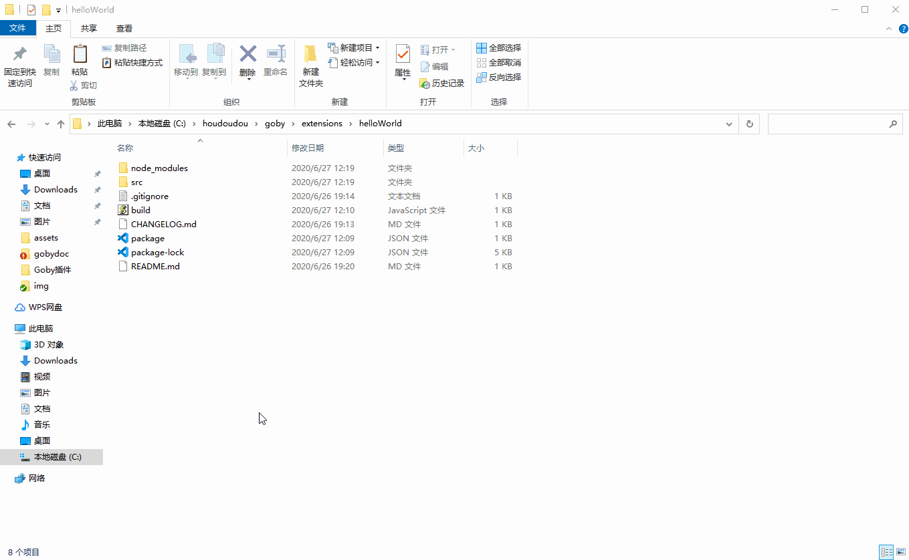


当然，jszip包只是提供的一种打包方案，具体你可以用自己喜欢的打包工具。

# 插件功能
## 概述
goby提供了一些方法，供插件扩展goby本身的能力。但是有的时候不容易找到合适的发布内容配置和goby API。这章内容将插件的功能分成了几个部分，每个部分都将告诉你：

 - 插件可以使用的功能
 - 一些插件灵感

不过，我们也会告诉你一些限制点，比如：插件不可以修改goby UI底层的DOM。

### 常用功能
常用功能是你在任何插件中都可能用到的核心功能。

这些功能包括：

 - 注册命令
 - 配置视图入口点
 - 使用用户自定义视图
 - 配置插件相关设置
 - 显示通知信息

### 扩展工作台
扩展工作台即用户可以配置的视图入口点，可以加强goby的功能，比如说你可以在扫描弹窗界面添加新的按钮，点击主动获取指定ip导入扫描对象中；也可以在ip详情页banner列表的部分新增按钮，点击对当前ip直接进行http发包测试；你甚至可以自定义一个html页面，来满足开发需求。

插件灵感

 - 定义扫描弹窗顶部的操作按钮和交互行为
 - 定义ip详情页banner列表的操作按钮和交互行为
 - 使用goby.showIframeDia方法显示自定义页面内容

### 限制
当然，插件也是有一些限制的。

插件没有权限访问goby UI的底层DOM，禁止添加自定义的CSS和HTML片段到goby UI上。

## 常用功能
常用功能对你的插件来说非常重要，几乎所有的插件都会或多或少的用到这些功能，下面为你简单地介绍一下它们。

### 命令
命令是插件运作的核心，所有你自定义的视图入口点，它绑定的函数都必须是命令。

一个插件最基本应该具备：使用goby.registerCommand注册命令。

### 视图入口点
用户可以自定义扫描弹窗顶部按钮，也可以自定义扫描页更多下拉的菜单内容。目前goby支持的视图入口点并不多，你可以在contributes.views中查看更多内容。

### 自定义视图
很多时候，只配置视图入口点是不能满足开发需求的，比如说你想实现点击扫描弹窗自定义的按钮后，显示一个自定义的可搜索的列表页面，让用户自己操作、选择，这时候就需要用到自定义视图。

使用goby.showIframeDia方法就可以显示自定义页面内容，在goby里会将你的页面嵌入到弹窗里进行显示，弹窗的标题，宽高等都可以通过参数进行设置。

### 插件相关设置
大部分插件在开发时，都会对外开放配置，如果你有这个需求，只要在contributes.configuration中填写有关的配置项即可。

同时，你可以通过goby.getConfiguration获取该插件配置项；也可以通过goby.setConfiguration设置该插件配置项。

### 通知信息
几乎所有的插件都需要在某些时候为用户提示信息。goby提供了4个API来展示不同重要程度的信息：

 - goby.showInformationMessage
 - goby.showWarningMessage
 - goby.showErrorMessage
 - goby.showSuccessMessage

## 扩展工作台
“工作台”是指整个goby UI，目前goby可配置的UI部分如下：

 - 扫描弹窗页 - scanDia
 - 扫描结果页 - scanRes
 - 更多下拉菜单 - moreOptions
 - ip详情页 - ipDetail
 -  banner列表的标题栏 - bannerTop
 - 漏洞列表页 - vulList

## 扫描弹窗页 - **scanDia**
在插件清单中配置contributes.views.scanDia，就可以给扫描弹窗顶部添加自定义的组件。具体位置如图：

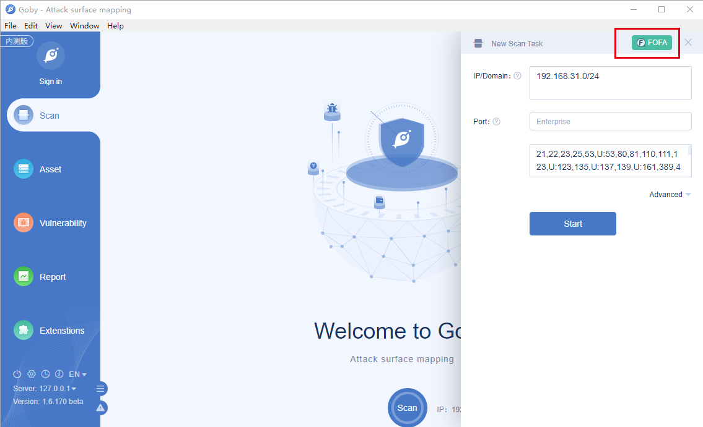

同时关于scanDia的具体使用，也有一个简单的例子可供学习，具体见扫描弹窗页。

## 扫描结果页 - **scanRes**
###### 更多下拉菜单 - moreOptions
在插件清单中配置contributes.views.scanRes.moreOptions，就可以给扫描结果的下拉菜单添加自定义的组件，同时资产列表、漏洞列表页的下拉菜单也会出现相同组件。具体位置如图：


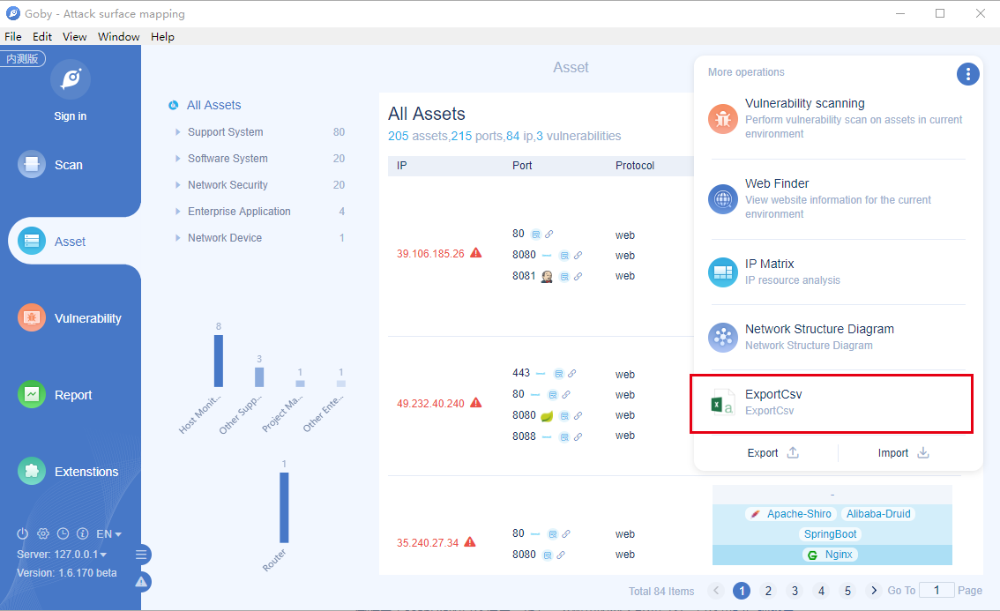
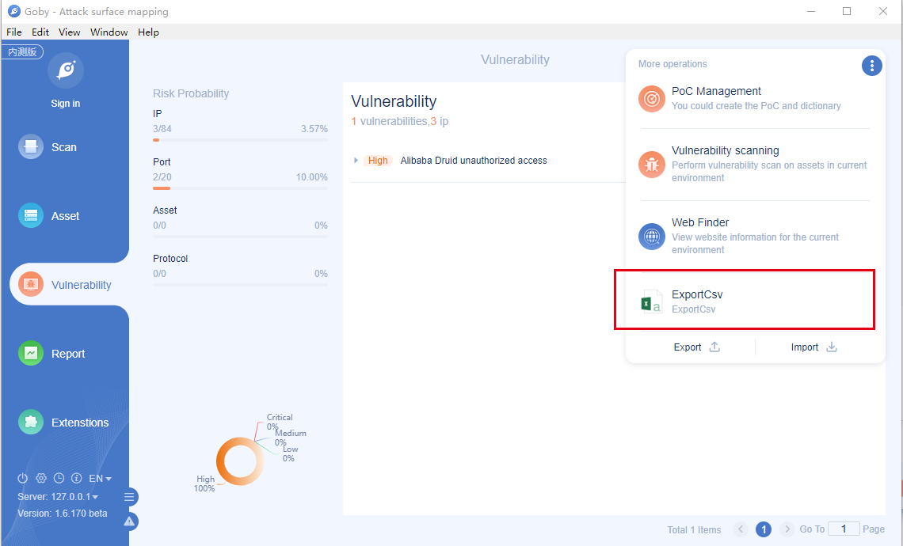

同时关于moreOptions的具体使用，也有一个简单的例子可供学习，具体见扫描结果页。

## ip详情页 - **ipDetail**
banner列表的标题栏 - bannerTop
在插件清单中配置contributes.views.ipDetail.bannerTop，就可以给ip详情页banner列表的标题栏添加自定义的组件。具体位置如图：


同时关于bannerTop的具体使用，也有一个简单的例子可供学习，具体见ip详情页。

## 漏洞列表页 - **vulList**
在插件清单中配置contributes.views.vulList，就可以给漏洞列表相关的页面添加自定义的组件。具体位置如图：

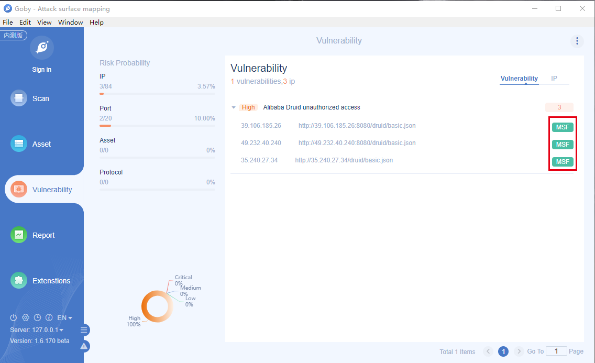
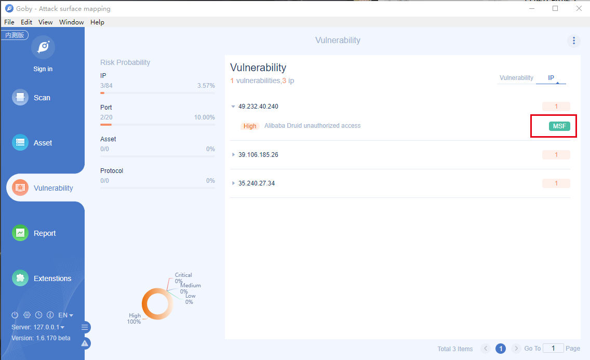
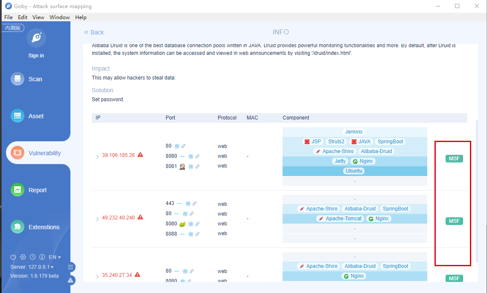


同时关于vulList的具体使用，也有一个简单的例子可供学习，具体见漏洞列表页。

# 插件示例
## 概述
在插件功能章节，从更宽泛的层面上介绍了插件能做些什么，本章则细化了各个功能点，并提供了详细的代码例子。

在每个示例中，你将会看到：

 - 使用的goby API列表
 - 使用的contributes（发布内容配置）列表
 - 示例插件的gif或者图片

## 扫描弹窗页 - scanDia
扫描弹窗页的配置，使得用户可以对扫描配置进行自定义的处理和操作，下面我们看一个简单的例子。这个例子主要是在扫描弹窗页里，新增一个按钮，点击显示自定义页面，在这个自定义页面里可以进行fofa查询，获取扫描对象，并导入到扫描ip、端口里。

### 下载链接
[FOFA](http://gobies.org/FOFA.zip)

### 使用的**goby API**

 - goby.registerCommand
 - goby.showIframeDia
 - goby.closeIframeDia
 - goby.getConfiguration
 - goby.showConfigurationDia
 - goby.addScanIps
 - goby.addScanPorts
 - goby.showInformationMessage
 - goby.showErrorMessage
 - goby.showSuccessMessage

### 示例
第一步，你需要注册自定义组件要触发的命令。

        
      

``` zephir
    function activate(content) {
            goby.registerCommand('fofa', function () {
              // 获取插件配置项
              let config = goby.getConfiguration();
              let email = config.email.default;
              let key = config.key.default;
              if (email && key) {
                let path = __dirname + "/fofa.html"
                // 显示自定义页面
                goby.showIframeDia(path, "fofa查询", "666", "500");
              } else {
                // 显示插件配置弹窗
                goby.showConfigurationDia();
              }
            });
          }
          
          exports.activate = activate;
```
        
      
第二步，你需要在package.json里配置对应视图入口点，即contributes.views.scanDia,填写想要的标题、对应的命令和icon。

        
      

``` json
    {
            "contributes": {
              "views": {
                "scanDia": [
                  {
                    "command": "fofa",
                    "title": "FOFA",
                    "icon": "src/assets/img/fofa.png"
                  }
                ]
              }  
            }
          }
```
        
      
第三步，因为使用了fofa查询，所以需要增加fofa账号和key的配置项，你需要在package.json的contributes.configuration字段里添加相关配置。

        
     

``` json
     {
            "contributes": {
              "configuration": {
                "email": {
                  "type": "string",
                  "default": "",
                  "description": "fofa email"
                },
                "key": {
                  "type": "string",
                  "default": "",
                  "description": "fofa key"
                }
              }
            }
          }
```
        
      
第四步，点击自定义的组件后，要显示用户自定义的界面，可以用goby.showIframeDia，传入html页面。

需要特别注意的是，在自定义的html页面里使用goby API对象时，必须通过parent.goby的方法获取。

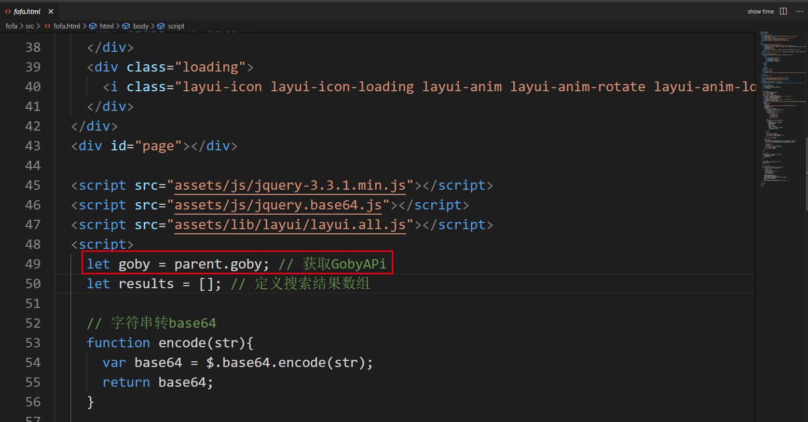

至于具体的代码内容，可以[下载代码](http://gobies.org/FOFA.zip)查看详细。

最终效果如下：

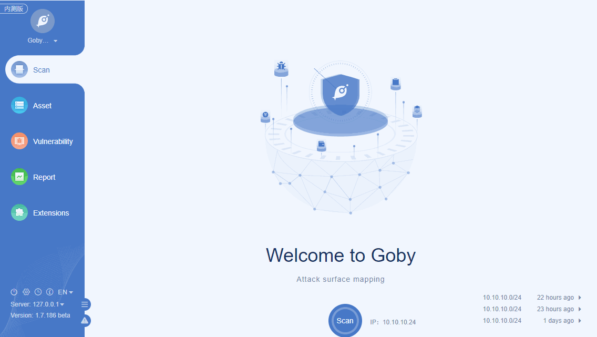

## 扫描结果页 - scanRes.moreOptions
扫描结果页的配置，使得用户可以对扫描后的结果进行自定义的处理和操作，下面我们看一个简单的例子。这个例子主要是在扫描结果页更多下拉框里，新增一个按钮，点击可以选择导出不同字段的csv文件的功能。

### 下载链接
[ExportCsv](http://gobies.org/ExportCsv.zip)

### 使用的**goby API**

 - goby.registerCommand
 - goby.showIframeDia
 - goby.closeIframeDia
 - goby.getTaskId
 - goby.getAsset
 - goby.showInformationMessage
 - goby.showErrorMessage
 - goby.showSuccessMessage

### 示例
第一步，你需要注册自定义组件要触发的命令。

        
     

``` lua
     function activate(content) {	
            goby.registerCommand('ExportCsv', function () {
              let path = __dirname + "/index.html"
              goby.showIframeDia(path, "导出", "334", "210");
            });
          }
          
          exports.activate = activate;
```
        
      
第二步，你需要在package.json里配置对应视图入口点，即contributes.views.scanRes.moreOptions,填写想要的标题、对应的命令和icon。

        
      

``` json
    {
            "views": {
              "scanRes": {
                "moreOptions": [
                  {
                    "command": "ExportCsv",
                    "title": "ExportCsv",
                    "icon": "src/assets/img/import.png"
                  }
                ]
              }
            }
          }
```
        
      
第三步，点击自定义的组件后，要显示用户自定义的界面，可以用goby.showIframeDia，传入html页面。

至于具体的代码内容，可以[下载代码](http://gobies.org/ExportCsv.zip)查看详细。

最终效果如下：

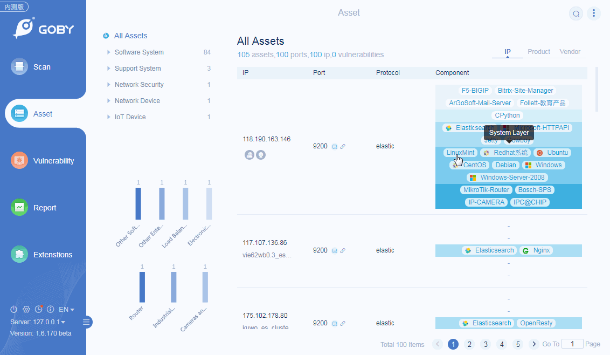

## ip详情页 - ipDetail.bannerTop
ip详情页的配置，使得用户可以对ip详情页进行自定义的处理和操作，下面我们看一个简单的例子。这个例子主要是在ip详情页的banner列表里，新增一个按钮，点击可以进行http发包测试。

### 下载链接
[Http](http://gobies.org/Http.zip)

### 使用的**goby API**

 - goby.registerCommand
 - goby.showIframeDia

### 示例
第一步，你需要注册自定义组件要触发的命令。

        
     

``` lua
     function activate(content) {
            goby.registerCommand('http', function (content) {
              let path = __dirname + "/http.html?hostinfo=" + content.hostinfo;
              goby.showIframeDia(path, "http发包", "441", "188");
            });
          }
          
          exports.activate = activate;
```
        
      
第二步，你需要在package.json里配置对应视图入口点，即contributes.views.ipDetail.bannerTop,填写想要的标题、对应的命令和icon。

        
   

``` xquery
       "contributes": {
            "views": {
             "ipDetail": {
                "bannerTop": [
                  {
                    "command": "http",
                    "title": "Http发包",
                    "icon": "src/assets/img/http.png"
                  }
                ]
             }
            }
           }
```
        
      
第三步，点击自定义的组件后，要显示用户自定义的界面，可以用goby.showIframeDia，传入html页面。

至于具体的代码内容，可以[下载代码](http://gobies.org/Http.zip)查看详细。

最终效果如下：


## 漏洞列表页 - vulList
漏洞列表页的配置，使得用户可以对漏洞相关的页面进行自定义的处理和操作，下面我们看一个简单的例子。这个例子主要是在漏洞相关的页面，根据当前漏洞名是否在自定义的列表里，动态显示MSF利用按钮，点击按钮可以一键调用本地Metasploit框架，对该漏洞进行检测。

### 下载链接
[MSF Sploit](http://gobies.org/MSF Sploit.zip)

### 使用的**goby API**

 - goby.registerCommand
 - goby.getConfiguration
 - goby.setConfiguration
 - goby.showInformationMessage
 - goby.showErrorMessage

### 示例
第一步，你需要注册自定义组件要触发的命令。与之前的几个例子不同的是，这里使用了控制组件是否显示的回调命令，它绑定在views的visible字段上，根据其返回的布尔值来决定是否显示该组件。

        
     

``` javascript
     let cp = require('child_process');
          const os = require('os');
          const fs = require('fs');

          function activate (content) {
              // msf 对应关系
              let identical = {
                  "Eternalblue/DOUBLEPULSAR MS17-010 SMB RCE": "exploit/windows/smb/ms17_010_eternalblue"
              };

              // 点击触发的命令
              goby.registerCommand('msf', function (content) {
                  let config = goby.getConfiguration();
                  console.log(config)
                  let ip = content.hostinfo.split(':')[0];
                  let arr = ['C:/metasploit-framework/bin/msfconsole.bat', 'D:/metasploit-framework/bin/msfconsole.bat', 'C:/metasploit-framework/msfconsole'];

                  let urlDefault = '';
                  if (config.url.default) {
                      urlDefault = config.url.default
                  } else {
                      let isExistence = arr.filter(v => {
                          return fs.existsSync(v)
                      })
                      urlDefault = isExistence[0];
                      goby.setConfiguration("url", urlDefault)
                  }

                  if (!urlDefault) return goby.showInformationMessage('Please set the plug-in installation path');

                  let url = `${urlDefault} -x "use ${identical[content.name]}; set rhosts ${ip} ; run"`
                  if (os.type() == 'Windows_NT') {
                      //windows
                      cp.exec(`start ${url}`)
                  } else if (os.type() == 'Darwin') {
                      //mac
                      cp.exec(`osascript -e 'tell application "Terminal" to do script "${url}"'`)
                  } else if (os.type() == 'Linux') {
                      //Linux
                      cp.exec(`bash -c "${url}"`)
                  }
              });

              // 控制组件是否显示的回调命令
              goby.registerCommand('msf_visi', function (content) {
                if (identical[content.name]) return true;
                return false;
              });
          }

          exports.activate = activate;
```
        
      
第二步，你需要在package.json里配置对应视图入口点，即contributes.views.vulList,填写想要的标题、对应的命令、以及控制该组件显示的回调命令。

        
     

``` xquery
     "contributes": {
            "views": {
              "vulList": [
                {
                  "command": "msf",
                  "title": "MSF",
                  "visible": "msf_visi"
                }
              ]
            }
          }
```
        
      
第三步，因为要调用本地Metasploit，所以需要增加Metasploit安装路径的配置项，你需要在package.json的contributes.configuration字段里添加相关配置。

        
   

``` xquery
       "contributes": {
            "configuration": {
              "url": {
                "type": "string",
                "default": "",
                "description": "请输入插件地址"
              }
            }
          }
```
        
      
至于具体的代码内容，可以[下载代码](http://gobies.org/MSF Sploit.zip)查看详细。

最终效果如下：

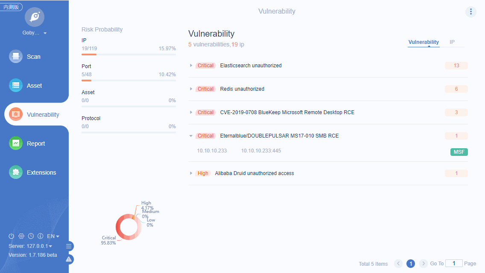

# 参考
## goby API
### 命令相关
goby API是goby提供给插件开发者使用的一系列Javascript API。以下是所有的goby API列表。

#### registerCommand
注册命令，不同插件的命令名称可以相同

**请求**

参数|类型|默认值|必填|说明
--|:--|:--|:--|:--
name|String| | 是|命令的名称
callback(content)|Function| | 是|命令的回调函数，回调函数返回的content内容，根据命令绑定的views（视图入口点）不同而变化

**callback(content)**

views(视图入口点)|是否存在|类型|示例|说明
--|:--|:--|:--|:--
scanDia|否	|	|	|
scanRes.moreOptions|否	|	|	|
ipDetail.bannerTop|是|Object	|{ hostinfo: "80.241.214.220:25", port: "25", protocol: "smtp" }|hostinfo: host信息；port: 端口；protocol: 协议
vulList|是|Object|{ "hostinfo":"127.0.0.1", "name":"Eternalblue/DOUBLEPULSAR MS17-010 SMB RCE", "filename":"smb_ms17_010.json", "level":"3", "vulurl":"", "keymemo":"", "hasexp":false }|hostinfo: host信息；name: 漏洞名称；filename: 漏洞文件名；level: 漏洞等级；vulurl: 漏洞地址

### UI相关
#### showIframeDia
显示内嵌iframe的弹窗

如果你需要在自定义的html页面里使用goby API，必需要调用parent.goby来获取实例对象

**请求**

参数|类型|默认值|必填|说明
--|:--|:--|:--|:--
url|String	|	|是|iframe的src地址
title|String	|	|否|iframe的标题
width|Number|666|否|iframe的宽度
height|Number|auto|否|iframe的高度，最大高度为500，超过显示滚动条

##### closeIframeDia
关闭内嵌iframe的弹窗

### 配置相关
#### getConfiguration
获取当前插件的相关配置

**请求**

参数|类型|默认值|必填|说明
--|:--|:--|:--|:--
name|String| |否|获取的插件配置字段名

**返回**

返回|类型|说明
--|:--|:--
value|Object/String|获取的插件配置值，如果不传name，返回插件相关的所有配置

#### setConfiguration
设置当前插件的相关配置

**请求**

参数|类型|默认值|必填|说明
--|:--|:--|:--|:--
name|String		||是|要设置的插件name
value|String	|	|是|要设置的插件value

#### showConfigurationDia
显示当前插件所有配置的弹窗界面

### 信息通知相关
#### showInformationMessage
显示普通消息通知

**请求**

参数|类型|默认值|必填|说明
--|:--|:--|:--|:--
message|String	|	|是|显示的信息内容

#### showWarningMessage
给用户显示警告消息通知

**请求**

参数|类型|默认值|必填|说明
--|:--|:--|:--|:--
message|String	|	|是|显示的信息内容

#### showErrorMessage
给用户显示报错消息通知

**请求**

参数|类型|默认值|必填|说明
--|:--|:--|:--|:--
message|String	|	|是|显示的信息内容

#### showSuccessMessage
给用户显示成功消息通知

**请求**

参数|类型|默认值|必填|说明
--|:--|:--|:--|:--
message|String	|	|是|显示的信息内容

### 数据相关
#### getTaskId
获取当前任务的id

**返回**

返回|类型|说明
--|:--|:--
taskId|String|当前任务的id

#### getAsset
获取当前任务的所有资产数据

**请求**

参数|类型|默认值|必填|说明
--|:--|:--|:--|:--
taskId|String	|	|是|任务id
callback(result)|Function	|	|是|资产数据的回调函数，result即当前任务的所有资产数据

**callback(result)**

属性|类型|说明
--|:--|:--
statusCode|Number|状态码，200为正常
messages|String|状态的相关信息
data|Object/null|资产数据的对象，无数据时是null

**result.data**

属性|类型|说明
--|:--|:--
taskId|String|任务id
query_total|Object|资产查询信息汇总
total|Object|资产数据相关统计
ips|Object|资产列表

**callback(result) 返回代码示例**
       

``` json
     {
              "statusCode": 200,
              "messages": "",
              "data": {
                "taskId": "20200509004148",
                "query_total": {
                  "ips": 7,
                  "ports": 11,
                  "protocols": 13,
                  "assets": 8,
                  "vulnerabilities": 0,
                  "dist_ports": 11,
                  "dist_protocols": 12,
                  "dist_assets": 6,
                  "dist_vulnerabilities": 0
                },
                "total": {
                  "assets": 8,
                  "ips": 7,
                  "ports": 11,
                  "vulnerabilities": 0,
                  "allassets": 0,
                  "allips": 0,
                  "allports": 0,
                  "allvulnerabilities": 0,
                  "scan_ips": 0,
                  "scan_ports": 0
                },
                "ips": [{
                  "ip": "192.168.31.213",
                  "mac": "d4:61:9d:63:62:06",
                  "os": "",
                  "hostname": "",
                  "ports": null,
                  "protocols": {},
                  "tags": [{
                    "rule_id": "10000011",
                    "product": "Apple_Device",
                    "company": "Apple",
                    "level": "1",
                    "category": "Server",
                    "parent_category": "Network Device",
                    "soft_hard": "1"
                  }],
                  "vulnerabilities": null,
                  "screenshots": null,
                  "favicons": null,
                  "hostnames": [""]
                }]
              }
            }
```
        
      
#### addScanIps
添加扫描ip

**请求**

参数|类型|默认值|必填|说明
--|:--|:--|:--|:--
ips|Array	|	|是|要添加的扫描ip数组
type|Number	|	|是|添加的方式，0是追加，1是覆盖

#### addScanPorts
追加扫描端口

**请求**

参数|类型|默认值|必填|说明
--|:--|:--|:--|:--
ports|Array| |是|要添加的扫描端口数组
type|Number	|	|是|添加的方式，0是追加，1是覆盖
## 发布内容配置
发布内容配置即插件清单package.json中的contributes字段，格式为JSON，这个字段包含两个部分：

 - configuration
 - views

### configuration
在configuration中配置的内容会暴露给用户，用户可以从“插件设置”中修改你暴露的选项。

**配置示例**

``` xquery
     "configuration": {
            "email": {
              "type": "string",
              "default": "",
              "description": "fofa email"
            },
            "key": {
              "type": "string",
              "default": "",
              "description": "fofa key"
            }
          }
```
        
      
你可以用goby.getConfiguration读取配置值。

 **配置结构**
 
你的配置内容同时也决定了在goby设置UI中的显示方式。


**配置字段说明**

字段|类型|说明
--|:--|:--
Name|String|配置的JSON对象的Name即图中1的位置，表示配置的字段名
Value|Object|Name对应的值

**Value**

字段|类型|说明
--|:--|:--
type|String|配置项的类型，目前只支持string
default|String|配置项的值，即图中2的位置
description|String|关于配置项的描述，即图中3的位置，划过会显示该内容的tips

### views
views即用户可配置的自定义视图入口点，目前可配置的UI部分如下：

 - 扫描弹窗页 - scanDia
 - 扫描结果页 - scanRes
 - 更多下拉菜单 - moreOptions
 - ip详情页 - ipDetail
 - banner列表的标题栏 - bannerTop
 - 漏洞列表页 - vulList

**配置字段说明**

字段|类型|默认值|必填|说明
--|:--|:--|:--|:--
command|String	|	|是|view绑定的命令
title|String	|	|否|自定义组件显示的文字内容
icon|String	|	|否|自定义组件显示的icon
tips|String	|默认显示title字段，如果title字段不存在，默认显示插件名称	|否	|自定义组件划过显示的tips
visible|	String|	默认显示|	否	|控制自定义组件是否显示的命令，返回true显示，返回false不显示

## 初始化事件
在插件安装成功后，如果你想直接执行一些操作，那就必须用到初始化事件，即initEvents。绑定要执行的命令名称，goby会在安装插件成功后，主动执行该命令。

### 相关示例
第一步，注册要自动执行的命令

        
     

``` scilab
     function activate (content) {
            goby.registerCommand('hello', function (content) {
              goby.showInformationMessage("helloWorld");
            });
            }
          
          exports.activate = activate;
```
        
      
第二步，initEvents绑定该命令

        
      

``` json
       {
            "name": "initEvents",
            "publisher": "Goby Team",
            "description": "initEvents by Goby Team",
            "initEvents": "hello"
         }
```
        
      
最终效果如下：当你下载安装该插件后，会直接执行hello命令，弹出信息提示。

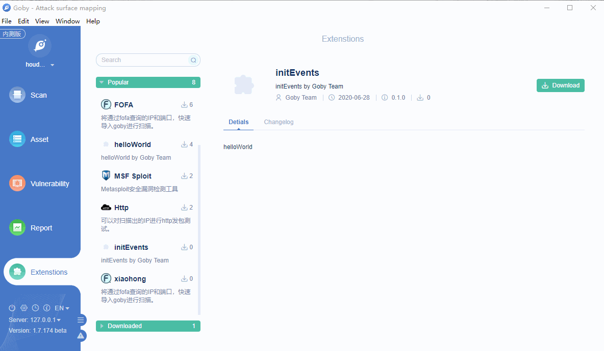

## 插件清单
每一个goby插件都需要一份插件清单（package.json），必须放在插件根目录下。

### 字段说明
名称|必须|类型|详细
--|:--|:--|:--
name|Y|String|插件的名称
publisher|Y|String|发布者的名称
engines|Y|String|插件依赖的最低goby版本，比如1.6.170
version|Y|String|插件的版本号，插件每次更新时，版本号都必须比之前高
main|Y|String|插件主入口文件
description|Y|String|简单地描述一下插件的功能
initEvents	|	|String|初始化事件，插件安装后自动执行的命令
icon	|	|String|插件的logo，建议使用32 * 32的尺寸
contributes|Y|Object|插件自定义组件的入口和配置等
scripts	|	|Object|等同于npm的scripts
devDependencies	| |Object	|等同于npm的devDependencies

### 完整示例
           

``` json
    {
            "name": "FOFA",
            "publisher": "Goby Team",
            "description": "将通过fofa查询的IP和端口，快速导入goby进行扫描。",
            "version": "0.1.0",
            "icon": "src/assets/img/fofa.png",
            "engines": "1.6.170",
            "initEvents": "fofa",
            "main": "./src/extension.js",
            "contributes": {
              "configuration": {
                "email": {
                  "type": "string",
                  "default": "",
                  "description": "fofa email"
                },
                "key": {
                  "type": "string",
                  "default": "",
                  "description": "fofa key"
                }
              },
              "views": {
                "scanDia": [
                  {
                    "command": "fofa",
                    "title": "FOFA",
                    "icon": "src/assets/img/fofa.png"
                  }
                ]
              }
            },
            "scripts": {},
            "devDependencies": {},
            "dependencies": {}
          }
```

